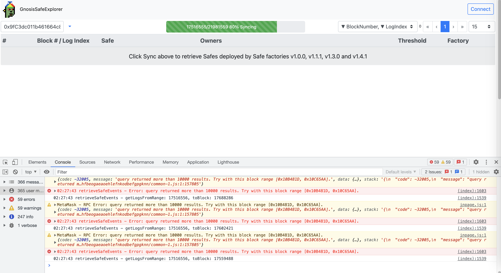
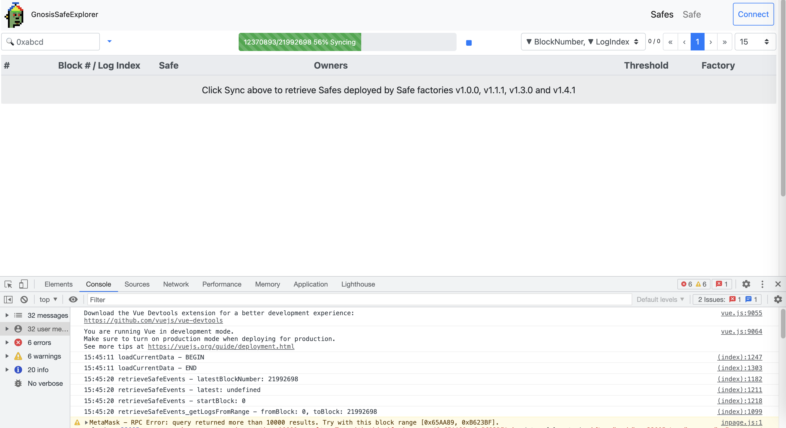
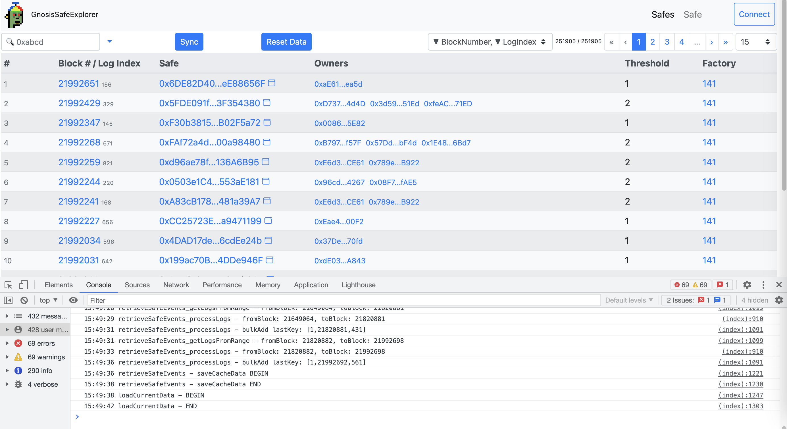
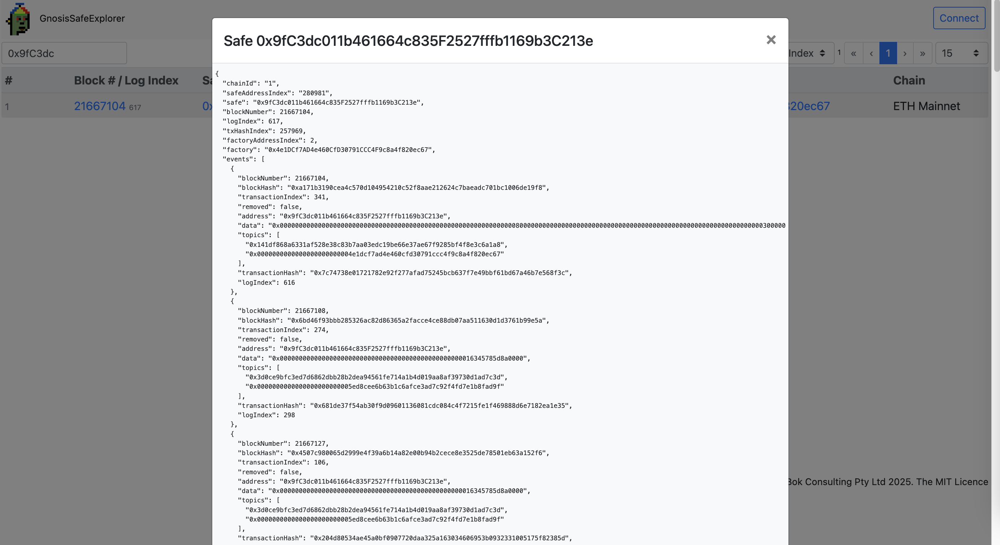

# Gnosis Safe Explorer (WIP)

Checking out Gnosis Safe, starting with Safe 1.1.1, the original code for the hacked `Bybit: Cold Wallet 1` at [0x1Db92e2EeBC8E0c075a02BeA49a2935BcD2dFCF4](https://etherscan.io/address/0x1Db92e2EeBC8E0c075a02BeA49a2935BcD2dFCF4)

From https://docs.safe.global/advanced/smart-account-supported-networks:

* create_and_add_modules.sol at [0xF61A721642B0c0C8b334bA3763BA1326F53798C0](https://etherscan.io/address/0xF61A721642B0c0C8b334bA3763BA1326F53798C0)
* create_call.sol at [0x8538FcBccba7f5303d2C679Fa5d7A629A8c9bf4A](https://etherscan.io/address/0x8538FcBccba7f5303d2C679Fa5d7A629A8c9bf4A)
* default_callback_handler.sol at [0xd5D82B6aDDc9027B22dCA772Aa68D5d74cdBdF44](https://etherscan.io/address/0xd5D82B6aDDc9027B22dCA772Aa68D5d74cdBdF44)
* [gnosis_safe.sol](contracts/GnosisSafe_1_1_1_0x34CfAC646f301356fAa8B21e94227e3583Fe3F5F.sol) at [0x34CfAC646f301356fAa8B21e94227e3583Fe3F5F](https://etherscan.io/address/0x34CfAC646f301356fAa8B21e94227e3583Fe3F5F)
* multi_send.sol at [0x8D29bE29923b68abfDD21e541b9374737B49cdAD](https://etherscan.io/address/0x8D29bE29923b68abfDD21e541b9374737B49cdAD)
* [proxy_factory.sol](contracts/ProxyFactory_1_1_1_0x76E2cFc1F5Fa8F6a5b3fC4c8F4788F0116861F9B.sol) at [0x76E2cFc1F5Fa8F6a5b3fC4c8F4788F0116861F9B](https://etherscan.io/address/0x76E2cFc1F5Fa8F6a5b3fC4c8F4788F0116861F9B)

 

Testing Safe 1.3.0 using the hacked `Bybit: Cold Wallet 1` at [0x1Db92e2EeBC8E0c075a02BeA49a2935BcD2dFCF4](https://etherscan.io/address/0x1Db92e2EeBC8E0c075a02BeA49a2935BcD2dFCF4) :

* [contracts/Safe_1_3_0.md](contracts/Safe_1_3_0.md) at [0xd9Db270c1B5E3Bd161E8c8503c55cEABeE709552](https://etherscan.io/address/0xd9Db270c1B5E3Bd161E8c8503c55cEABeE709552#code)

Testing Safe 1.4.1 using `EF: DeFi Multisig` at [0x9fC3dc011b461664c835F2527fffb1169b3C213e](https://etherscan.io/address/0x9fC3dc011b461664c835F2527fffb1169b3C213e) :

* [contracts/Safe_1_4_1.md](contracts/Safe_1_4_1.md) at [0x41675C099F32341bf84BFc5382aF534df5C7461a](https://etherscan.io/address/0x41675C099F32341bf84BFc5382aF534df5C7461a#code)

 

---

Web3 dapp: https://bokkypoobah.github.io/GnosisSafeExplorer/ connected to Ethereum Mainnet (WIP)

 

---

### Sample Screens

Syncing. There will be errors reported in the Developer Pane.

<kbd></kbd>

251,111 v1.3.0 and v1.4.1 Gnosis Safes have been deployed at this time. Syncing takes ~ 7 minutes

<kbd></kbd>

Search by Safe address. The second address in the dropdown is not working at the moment.

<kbd></kbd>

Search by Safe address, or fragment

<kbd></kbd>

 

---

### Reference

* https://docs.safe.global/advanced/smart-account-supported-networks

 

 

Enjoy!

(c) BokkyPooBah / Bok Consulting Pty Ltd 2025. The MIT License
